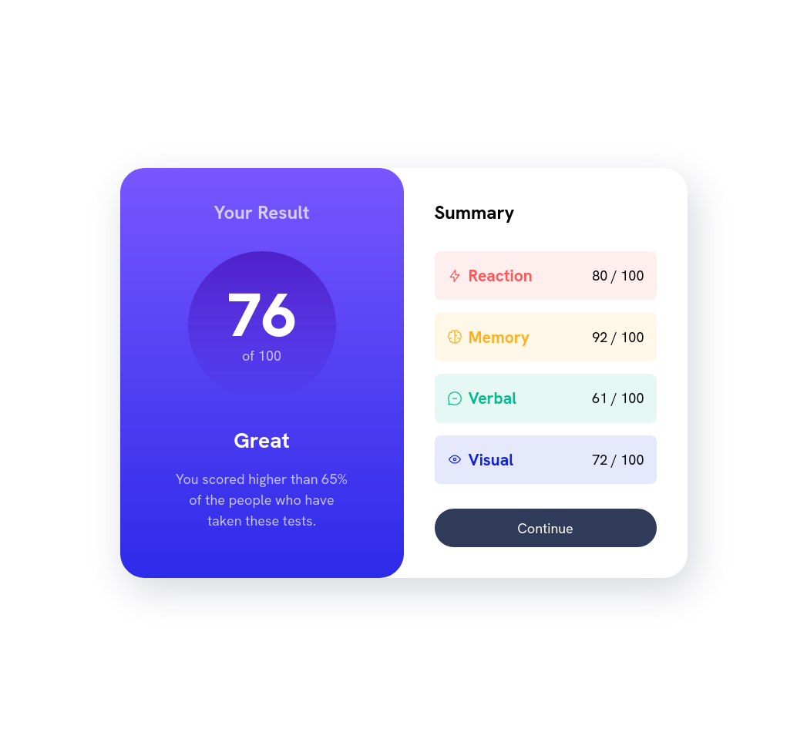
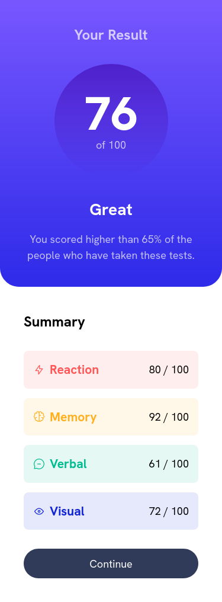

# Frontend Mentor - Results summary component solution

This is a solution to the [Results summary component challenge on Frontend Mentor](https://www.frontendmentor.io/challenges/results-summary-component-CE_K6s0maV). Frontend Mentor challenges help you improve your coding skills by building realistic projects. 

## Table of contents

- [Overview](#overview)
  - [The challenge](#the-challenge)
  - [Screenshot](#screenshot)
  - [Links](#links)
- [My process](#my-process)
  - [Built with](#built-with)
  - [What I learned](#what-i-learned)
  - [Continued development](#continued-development)
- [Author](#author)

**Note: Delete this note and update the table of contents based on what sections you keep.**

## Overview

### The challenge

Users should be able to:

- View the optimal layout for the interface depending on their device's screen size
- See hover and focus states for all interactive elements on the page

### Screenshot




### Links

- Solution URL: [Add solution URL here](https://your-solution-url.com)
- Live Site URL: [Add live site URL here](https://your-live-site-url.com)

## My process

### Built with

- Semantic HTML5 markup
- CSS custom properties
- SCSS
- Combined Flexbox & Grid
- Mobile-first workflow
- [Angular](https://angular.io/) - JS Framework

### What I learned

This is the first frontend-mentor project that I have built using angular so it was a learning experience to get an angular project set up using scss and mixins. It was also my first time seeing an angular project through completely, from initializing the project to buildingand deploying it onto netlify.

It was also my first time loading JSON data direcly into angular using the setting in the tsconfig.json file.
```
"resolveJsonModule": true,
```
Though the JS and SCSS required for this project was basic I am happy with the implementation, I especially liked the use of data attributes for setting the colour of the summary-item components dynamically. 

```scss
.summary-item {
    &[data-item-type="accent-1"] {
        --accent-clr: var(--clr-accent-1);
    }
}
```
This allows easy setting of the colour of three seperate components using CSS custom properties using the var(--accent-clr) property. 

In this project as the icon urls were included with the json data they were not coloured. However in my non-angular version of this project i used them as inline svg elements which allowed me to directly set their stroke attribute using the same var(--accent-clr) custom property so that the colours were fully changed on the fly.

### Continued development

An area that I would like to learn more is with better implementation of scss into an angular project, use of mixins and ensuring that the CSS is structured in a way that scales well as projects increase in size

## Author

- Frontend Mentor - [@sh-ct](https://www.frontendmentor.io/profile/sh-ct)
